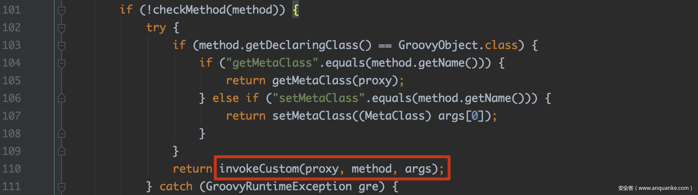
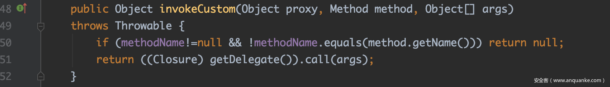

## groovy代码注入
groovy代码注入就是允许你执行Groovy代码或者允许你加载Groovy文件，并且程序并没有对其进行过滤，导致我们能够通过Groovy执行恶意代码，实现代码注入

## groovy反序列化漏洞
利用cc1链，注意groovy版本要小于`2.4.4`，在大于`2.4.3`的版本中，Groovy禁止了`MethodClosure`的反序列化

代码见[GroovyDeSerializeLeak.java](src/main/java/org/example/GroovyDeSerializeLeak.java)

### ConvertedClosure
这个ConvertedClosure也是继承了InvocationHandler，可以在动态代理中作为handler的存在，来看一下他的invoke

ConvertedClosure调用的是父类org.codehaus.groovy.runtime.ConversionHandler#invoke

主要看这个部分，对于当前调用的函数，如果非Object的函数(如toString、hashCode等)，并且不是GroovyObject的函数，会去调用子类的invokeCustom，这里看org.codehaus.groovy.runtime.ConvertedClosure#invokeCustom

这里的属性都是可控的，也就意味着我们可以去调用去调用前面构造好的MethodClosure，这里后续调用call的过程可以看最近的这篇[文章](https://paper.seebug.org/1171/)

### 排查方法

| 关键                             | 关键函数       |
|--------------------------------|------------|
| groovy.lang.GroovyShell        | evaluate   | 
| groovy.util.GroovyScriptEngine | run        |
| groovy.lang.GroovyClassLoader	 | parseClass |
|javax.script.ScriptEngine	|eval|
## 参考链接

- [Java安全中Groovy组件从反序列化到命令注入及绕过和在白盒中的排查方法](https://xz.aliyun.com/t/12015?time__1311=GqGxR70QnD9DlrzG7DymIGCI%3DqAIh3P3x)
- [Groovy语言与注入](https://pysnow.cn/2024/09/13/javasec/%E5%9F%BA%E7%A1%80/Groovy)
- [回顾XStream反序列化漏洞](https://www.anquanke.com/post/id/204314#h3-7)